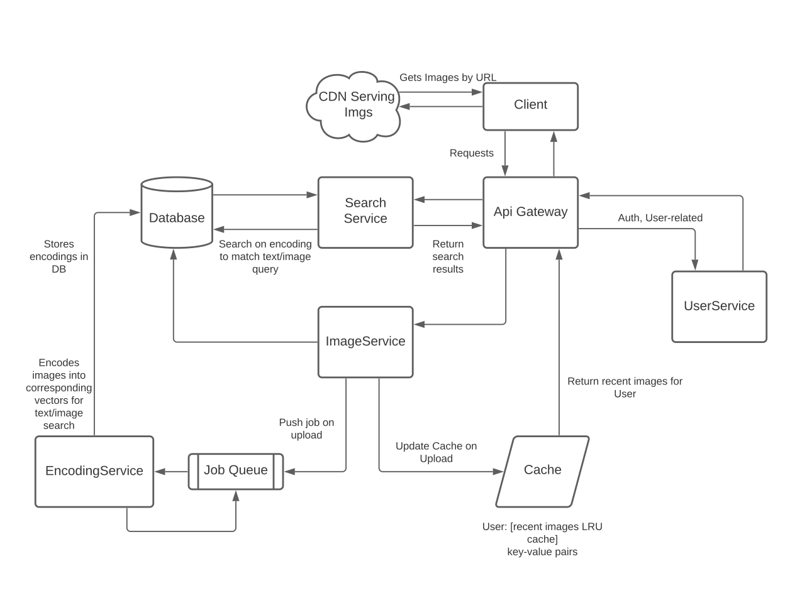

# PhotoRepo

## Proposed Architecture for Adding Images and Search

### //Could not implement Search

## Core Ideas

- Unit of data in the system is the ref to the image stored in the CDN.
- Architected to split functionality into different services, did not but should be implemented as such.

## Requirements

### Adding Images

    - uploading a single image
    - uploading multiple images
    - uploading can be only done if authenticated (through jwt session tokens)
    - images have a visibility property: if the field private is false, then the img is public

### Getting Images

    - get all public images
    - if authenticated, get all public as well user's images

## How Search Would be Implemented

    Although I was not able to implement search, this is how I would have gone about implementing it:

### Search from text:

    We would use a neural network to derive a textual representation of the semantic content of the image. These textual representations could be captions/semantic summaries. This encoding would be carried out by an encoding service which listens for jobs on a job queue. The Image service which handles uploads from the API will post a job on the queue with a ref to the image once it uploads to the CDN.

    There are current many such pretrained networks available. Transformers are a well-suited architecture for this case.
    See https://www.tensorflow.org/tutorials/text/image_captioning for reference.

### Search using another image\*\*

    We could again use a neural network to encode high level features of uploaded images into vector space using the encoding service described above. However, this time we will also encode the query image, get its vector representation, and then calculate the vector distance between the query image and the images in the database. A potential distance function is the cosine distance function.

    However, this is not really efficient as the complexity is O(no. of images in the database). I wonder if some form of caching may help. Perhaps one can also look at clustering algorithm over the images in the DB, followed by getting an average vector of the cluster, which can be compared to the query, and the cluster with lowest distance score is search through.

    There is a similar idea in NLP with cosine similarity based semantic search using transformers.

### Tags/Keywords/Labels, etc

    We could also use tags, keywoards, etc. specified by the user, or derived through algorithms to search by different indices, however I personally think encoding into vector spaces is a better idea both computationally (avoiding expensive string matching) and in terms of accuracy of results (higher probability to give the user what they want).

## Improvements

    - Security: static level security (where and how data is stored, read and written), and dynamic-level security (how secure is the movement of data throughout the system). Encryption both static and dynamic, access control restricted to specific services, gateway using reverse proxy,only internal networking and no public-level networking between services, are things that come to mind.

    - I would further explore ways to improve speed especially with respect to interactions by the user, and robustness of the system in general (less potential for data loss, uptime, etc.)

    - Stateless: something which I am trying to learn and understand is how can we make such systems stateless. Simplicity, easy to reboot after errors, immunity from hard-to-find edge-case bugs, are some obvious virtues.

## References

File Upload With Multer in Node.js and Express
https://code.tutsplus.com/tutorials/file-upload-with-multer-in-node--cms-32088
